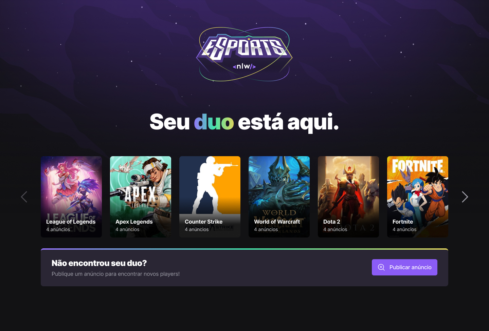
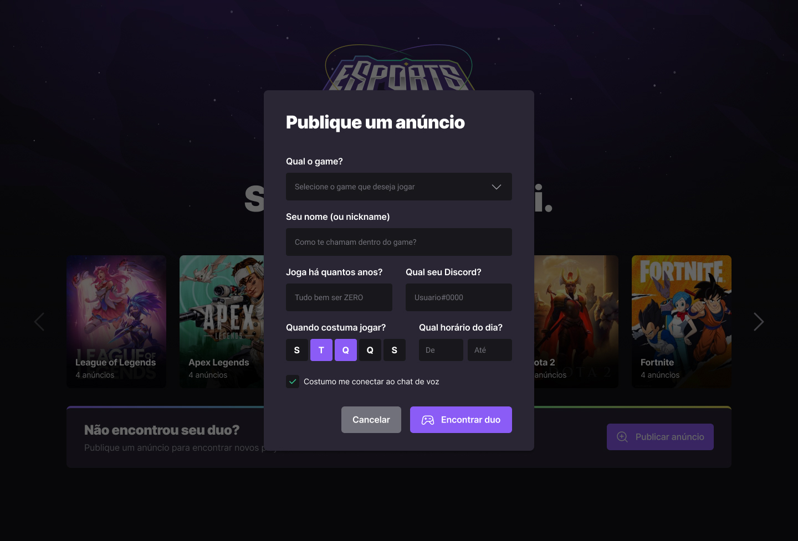
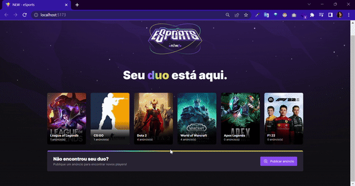

# :joystick: NLW- eSports Find Your Duo

Projeto voltado para área de eSports e a ideia é basicamente conseguir conectar pessoas que jogam os mesmos games. A pessoa vai acessar a versão Web, visualizar todos os games e quais jogos tem mais anúncios e se quiser poderá publicar um anúncio com qual o jogo, seu nome e se a pessoa está procurando um parceiro para jogar, com horarios, discord…

 

    

 

    

 
 

  
##  :rocket: Demonstração

 

    

Projeto no <a href = "https://www.figma.com/file/AUUQl7iXRtlZw8j4e1zG3B/NLW-eSports-(Community)?node-id=7%3A123">Figma </a>
 

 

## :computer: Tecnologias 

- ReactJs 

- React Native 

- Expo

- Vite 

- Prisma

- SQLite

- TailwindCSS

- Radix 

- Phosphor Icons 

 
 

## :screwdriver: Melhorias

Terminar a construção da aplicação Mobile, deixar a aplicação Web responsiva, fazer carrossel pra listagem dos games, usar o Radix para criar o componente Select, fazer validação - React Hook Form, fazer autenticação com Discord... 

##

Feito por mim com :purple_heart: junto com a Rocketseat :rocket: 

